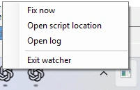
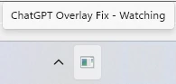

# ChatGPT Overlay Fix

A PowerShell workaround for broken mouse interaction with floating ChatGPT overlays on Windows, including the **Pet** and **Voice widget**.

**Version 3.0.0 adds an optional automatic watcher, tray icon and autostart support.**

If you only want to run the workaround once manually, you only need **`Fix-ChatGPT-Overlays.ps1`**.

## Choose how you want to use it

### Manual one-time fix

Download only:

- [`Fix-ChatGPT-Overlays.ps1`](Fix-ChatGPT-Overlays.ps1)

Start ChatGPT, make sure the affected overlay is visible, then run:

```powershell
.\Fix-ChatGPT-Overlays.ps1
```

The script applies the workaround once and then exits.

### Automatic mode

Download these three files into the same folder:

- [`Fix-ChatGPT-Overlays.ps1`](Fix-ChatGPT-Overlays.ps1)
- [`Watch-ChatGPT-Overlays.ps1`](Watch-ChatGPT-Overlays.ps1)
- [`Autostart-Fix-ChatGPT-Overlays.ps1`](Autostart-Fix-ChatGPT-Overlays.ps1)

Run:

```powershell
.\Autostart-Fix-ChatGPT-Overlays.ps1
```

Then choose **`[1] Install using Scheduled Task (recommended)`**.

The package is installed for the current user, the watcher is started immediately, and it will start again automatically at logon.


## Tray watcher

The watcher runs hidden and adds a tray icon. Right-click it to run the fix manually, open the script folder or log, remove autostart when installed, or exit the watcher.



The tray tooltip shows the current watcher state, for example `Watching`, `Waiting for ChatGPT`, `Waiting for overlay`, or `Error`.



## What it does

- Restores click/drag interaction for affected ChatGPT floating overlays.
- Keeps the original window style and restores it after the temporary reset.
- Can automatically detect a new ChatGPT session and apply the workaround when a matching overlay appears.
- Provides a tray menu with **Fix now**, log access and watcher controls.
- Supports per-user autostart using either a **Scheduled Task** or the **Startup folder**.
- Detects ChatGPT version changes and records watcher state locally.

## Requirements

- Windows
- ChatGPT desktop app
- Windows PowerShell 5.1 or compatible PowerShell on Windows
- No additional PowerShell modules
- No administrator privileges required for the normal per-user installation

The scripts do not change your PowerShell execution policy. Environments that block unsigned scripts may require an administrator-approved policy or code signing.

## Interactive autostart manager

Running `Autostart-Fix-ChatGPT-Overlays.ps1` without parameters opens the interactive menu:

```text
ChatGPT Overlay Fix 3.0.0

Select an action:

  [1] Install using Scheduled Task (recommended)
  [2] Install using Startup folder
  [3] Show status
  [4] Remove autostart
  [5] Cancel
```

The Scheduled Task method is recommended for most users. It creates a limited, current-user task that starts the watcher at logon. The Startup-folder method creates a current-user shortcut instead.

Installation copies the complete package to:

```text
%LOCALAPPDATA%\ChatGPT-Overlay-Fix
```

Existing package files in that location are replaced by the version being installed, and the watcher is started after installation.

## Command-line mode

The same manager can be used non-interactively:

```powershell
.\Autostart-Fix-ChatGPT-Overlays.ps1 -Install
.\Autostart-Fix-ChatGPT-Overlays.ps1 -Install -Method Task
.\Autostart-Fix-ChatGPT-Overlays.ps1 -Install -Method Startup
.\Autostart-Fix-ChatGPT-Overlays.ps1 -Status
.\Autostart-Fix-ChatGPT-Overlays.ps1 -Remove
```

`-Install` defaults to the Scheduled Task method. Parameter mode does not display the interactive menu or wait for interactive confirmation.

`-Remove` removes the autostart entry only. Installed files and an already-running watcher are intentionally left unchanged.

## Tray menu

Depending on the current state, the tray menu provides:

- **Fix now** - runs the one-shot fix immediately.
- **Open script location** - opens the installed script folder.
- **Remove autostart...** - shown only when this package owns an autostart entry; the watcher keeps running until you exit it.
- **Open log** - shown when the watcher log exists.
- **Exit watcher** - stops the current watcher process.

Only one watcher instance is allowed per Windows user session.

## Automatic watcher behavior

The watcher checks the ChatGPT process state every two seconds.

When a new ChatGPT session is detected, it waits for a matching overlay window and can make up to three automatic fix attempts for that session. After a successful fix it stays in `Watching` state until the ChatGPT session changes.

The watcher stores local state in:

```text
%LOCALAPPDATA%\ChatGPT-Overlay-Fix\state.json
```

and logs to:

```text
%LOCALAPPDATA%\ChatGPT-Overlay-Fix\Watcher.log
```

The log is rotated when it reaches approximately 1 MB; the previous log is kept as `Watcher.log.old`.

If the detected ChatGPT version changes, the watcher records the change and shows a notification. The workaround remains enabled.

## How the workaround works

The one-shot fix operates only on top-level windows owned by running `ChatGPT` processes.

For each matching visible `Chrome_WidgetWin_1` layered overlay window, it:

1. Reads and saves the complete original extended window style.
2. Temporarily clears only `WS_EX_LAYERED`.
3. Calls `SetWindowPos()` with `SWP_FRAMECHANGED` to refresh the native window state.
4. Waits three seconds.
5. Restores the exact original extended window style.
6. Calls `SWP_FRAMECHANGED` again.
7. Verifies that the original style was restored.

The important part is the temporary reset. `WS_EX_LAYERED` is **not** left disabled.

On affected systems, this appears to re-synchronize the native overlay/input state and restore mouse interaction.

## Why `WS_EX_LAYERED`?

The upstream issue includes diagnostics around extended window styles such as `WS_EX_TRANSPARENT`, which can directly make a window click-through.

Additional testing showed that the workaround does not need to permanently remove any final style bit. Temporarily clearing `WS_EX_LAYERED`, refreshing the frame, and then restoring the complete original style is enough to recover the affected overlay state on tested systems.

## Safety

The workaround intentionally makes only temporary runtime changes to matching ChatGPT overlay windows.

It does **not**:

- modify ChatGPT application files,
- modify the registry,
- install third-party software,
- permanently remove window styles,
- request elevation for the normal per-user setup,
- change PowerShell execution policy.

The one-shot fix restores the complete original extended style in a `finally` block and verifies the restored value.

The automatic package installs only under the current user's `%LOCALAPPDATA%` and uses current-user autostart.

## Troubleshooting

If the manual fix reports that no matching overlay was found:

1. Make sure the ChatGPT desktop app is running.
2. Make sure the affected Pet or Voice overlay is currently visible.
3. Run the script in the same Windows user session as ChatGPT.

If automatic mode is installed but nothing happens, use the tray menu to open `Watcher.log` and check the current tray status.

If the fix reports that the original style could not be restored, restart the ChatGPT desktop app before further testing.

## Limitations

This is a **workaround**, not a fix for the underlying ChatGPT application bug.

The behavior depends on the current native overlay implementation and may stop working if the desktop app changes how its overlay windows are implemented.

## Version history

- **3.0.0** - current version: one-shot fix, automatic watcher, tray controls, status tracking and autostart manager. Preserved in the [`release/v3.0.0`](../../tree/release/v3.0.0) branch.
- **2.1** - previous manual-only version, preserved in the [`archive/v2.1`](../../tree/archive/v2.1) branch.

## Related upstream issue

**[openai/codex#41513](https://github.com/openai/codex/issues/41513)**  
`[Windows][Pets] Built-in and custom floating pets become click-through and cannot be dragged`

Relevant workaround discussion: **[issue comment 5538221946](https://github.com/openai/codex/issues/41513#issuecomment-5538221946)**.

## License

MIT License. See [LICENSE](LICENSE).

## Disclaimer

This is an unofficial community workaround and is not affiliated with or endorsed by OpenAI.

Use it at your own risk.
